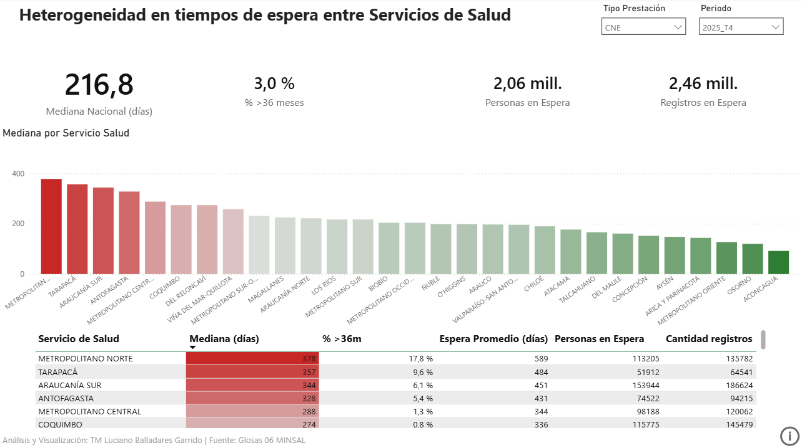
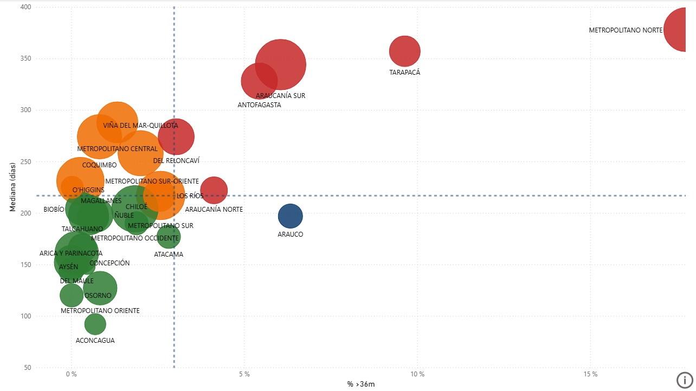
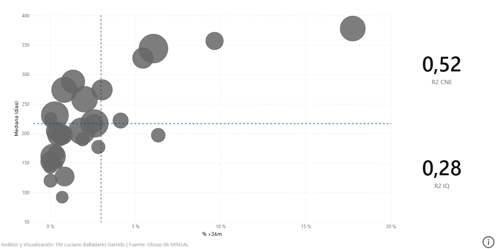
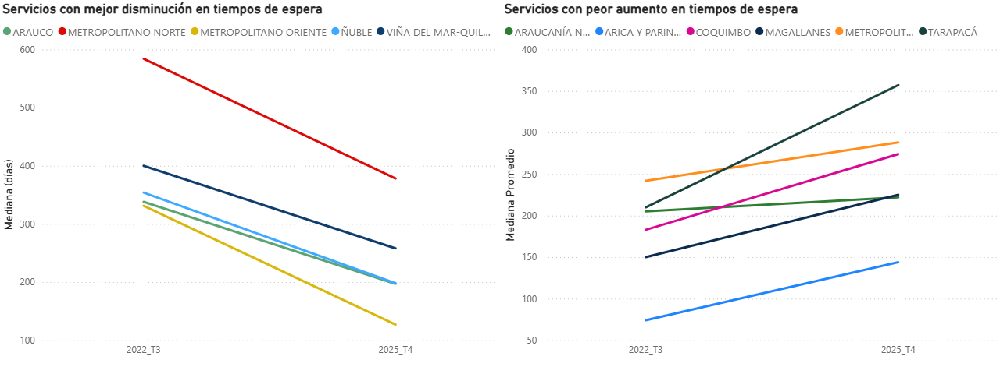

# Análisis Longitudinal de Listas de Espera NO GES en Chile

### Heterogeneidad territorial, perfiles operacionales y recuperación post-pandemia

[](https://github.com/LucianoBalladares/Analisis-de-Listas-de-Espera-No-GES/actions/workflows/ci.yml)
[](https://www.python.org/)
[](https://www.postgresql.org/)
[](https://app.powerbi.com/view?r=eyJrIjoiNDFhZDFlMWYtYzhkMC00NjRjLWIzNzItMGY1MWEyNDUwZmE5IiwidCI6IjZmZDQ4ZjQxLWFmODEtNDVhNS05YzFlLWUzOTkwYmMyN2U3YyIsImMiOjR9)
[](LICENSE)

**🔗 Dashboard interactivo:** [Ver en Power BI Service](https://app.powerbi.com/view?r=eyJrIjoiNDFhZDFlMWYtYzhkMC00NjRjLWIzNzItMGY1MWEyNDUwZmE5IiwidCI6IjZmZDQ4ZjQxLWFmODEtNDVhNS05YzFlLWUzOTkwYmMyN2U3YyIsImMiOjR9)
&nbsp;&nbsp;**📄 Reporte completo:** [Análisis Longitudinal — Mayo 2026 (PDF)](Reporte_Mayo_2026.pdf)

---

## Hallazgos clave

| Indicador                              | Valor                             |
| -------------------------------------- | --------------------------------- |
| Períodos con mediana disponible        | 13 trimestres (2022 T3 – 2025 T4) |
| Servicios de Salud analizados          | 29 SS del sistema público         |
| Reducción mediana IQ (2022–2025)       | −171 días (−41,6 %)               |
| Brecha CNE entre SS extremos (2025 T4) | 286 días                          |
| R² mediana vs cola larga — IQ 2022 T3  | 0,88 → 0,28 en 2025 T4            |

> La crisis post-pandemia fue inicialmente homogénea (R²=0,88 en IQ, 2022 T3) y se fragmentó
> en perfiles heterogéneos durante la recuperación. Los mismos Servicios de Salud que encabezaban
> la lista en 2022 la encabezan en 2025, aunque a valores absolutos menores.

---

## Vista previa del dashboard

|                   Panorama nacional (Pág. 1)                    |                    Perfiles operacionales (Pág. 4)                    |
| :-------------------------------------------------------------: | :-------------------------------------------------------------------: |
|  |  |

|                     Dispersión y R² (Pág. 3)                     |                      Recuperación territorial (Pág. 6)                      |
| :--------------------------------------------------------------: | :-------------------------------------------------------------------------: |
|  |  |

---

## Descripción del proyecto

Este proyecto analiza la **heterogeneidad territorial en la recuperación de las listas de espera
NO GES en Chile**, construyendo series longitudinales trimestrales desde 2021 hasta 2025 para
los 29 Servicios de Salud del sistema público.

A diferencia de aproximaciones descriptivas centradas exclusivamente en volumen de casos,
este trabajo incorpora tres dimensiones analíticas simultáneas: velocidad de respuesta del sistema
(mediana de espera), severidad histórica (proporción de casos con más de 36 meses de antigüedad)
y estructura de la red asistencial (concentración de la demanda en nivel terciario). La combinación
de estas dimensiones permite identificar cuatro perfiles operacionales diferenciados con necesidades
de intervención distintas.

El pipeline de datos es completamente reproducible: desde la extracción OCR de documentos PDF
oficiales (Glosa 06 – MINSAL) hasta la carga en PostgreSQL y la visualización en Power BI,
cada paso está automatizado, documentado y cubierto por tests unitarios y de integración.

---

## Pregunta de investigación

> ¿Cómo evolucionó la heterogeneidad territorial en los tiempos de espera NO GES entre los
> 29 Servicios de Salud de Chile durante 2022–2025, y qué perfiles operacionales diferenciados
> emergieron durante la recuperación post-pandemia?

**Pregunta complementaria:** ¿En qué medida la concentración de la demanda en el nivel de atención
terciario se asocia descriptivamente a los perfiles de congestión identificados?

---

## Enfoque analítico

El análisis se estructura en torno a tres dimensiones:

**Recuperación del sistema** — Mediana de días de espera por Servicio de Salud. El delta de
recuperación se calcula en Power BI mediante una medida DAX que identifica automáticamente el
primer y último trimestre con mediana disponible para cada SS, manejando correctamente los períodos
sin datos mediante `FIRSTNONBLANK` / `LASTNONBLANK`.

**Severidad de la espera** — Proporción de casos con antigüedad superior a 24 y 36 meses
(`pct_mayor_24m`, `pct_mayor_36m`). El coeficiente R² entre mediana y cola histórica se calcula
como medida DAX usando el coeficiente de correlación de Pearson (umbral mínimo N ≥ 5 SS).
Su evolución de 0,88 (IQ, 2022 T3) a 0,28 (IQ, 2025 T4) evidencia la fragmentación de los
perfiles de recuperación.

**Estructura de la red** — Concentración de la demanda en nivel terciario (`pct_nivel_terciario`),
usado como proxy descriptivo de fragmentación funcional de la red asistencial.

---

## Fuente de datos

**Glosa 06 – Ley de Presupuestos (MINSAL)**

- Datos oficiales de carácter público, disponibles en [www.minsal.cl](https://www.minsal.cl)
- Periodicidad trimestral
- Nivel de agregación: nacional y por Servicio de Salud
- Contiene: medianas y promedios de espera, volumen de casos, distribución por nivel de
  atención y tramos de antigüedad

La disponibilidad de variables varía por período y tipo de prestación.
El detalle completo se encuentra en [`docs/limitaciones.md`](docs/limitaciones.md).

---

## Pipeline de datos

```
Glosa 06 (PDF / imágenes)
        │
        ▼
[Fase 1] OCR sin separadores de miles
         + verificación manual de 3 valores al azar por archivo
        │
        ▼
[Fase 2] Estructuración manual en Excel (3 hojas estandarizadas)
        │
        ▼
[Fase 3] excel_a_sql.py — Ingesta Python
         · Filtrado de filas de totales
         · Normalización de ss_id (catalogos.py — fuente única de verdad)
         · Normalización de tipo_prestacion y nivel_atencion
         · Conversión numérica con manejo de errores OCR
         · UPSERT idempotente en PostgreSQL
        │
        ▼
[Fase 4] run_transformations.py — Transformaciones SQL
         · Segunda normalización de ss_id (exacta + ILIKE fallback)
         · Recálculo de asimetría faltante
         · Detección de incoherencias en tramos de antigüedad
        │
        ▼
PostgreSQL — Esquema con vistas optimizadas para Power BI
```

El catálogo de los 29 Servicios de Salud (nombres canónicos y aliases de normalización)
está centralizado en [`pipeline/config/catalogos.py`](pipeline/config/catalogos.py),
que actúa como única fuente de verdad para todos los módulos del pipeline.

---

## Instrucciones de uso

### Requisitos previos

- Python ≥ 3.10
- PostgreSQL ≥ 12

### 1. Configurar el entorno

```bash
# Verificar versión de Python
python --version

# Crear y activar entorno virtual
python -m venv .venv
source .venv/bin/activate        # Linux / macOS
# .venv\Scripts\activate         # Windows

# Instalar dependencias
pip install -r requirements.txt
```

### 2. Configurar la base de datos

```bash
# Copiar y completar variables de entorno
cp .env.example .env

# Crear la base de datos
psql -U postgres -c "CREATE DATABASE listas_espera_ges;"

# Inicializar esquema (en este orden)
psql -U postgres -d listas_espera_ges -f sql/schema/create_tables.sql
psql -U postgres -d listas_espera_ges -f sql/schema/constraints.sql
psql -U postgres -d listas_espera_ges -f sql/schema/indexes.sql
psql -U postgres -d listas_espera_ges -f sql/schema/triggers.sql
psql -U postgres -d listas_espera_ges -f sql/views/dashboard_views.sql
```

### 3. Probar con datos de muestra

El directorio [`data/sample/`](data/sample/) contiene un archivo Excel del período 2023 T1
para verificar el funcionamiento del pipeline sin necesidad de acceder a la fuente original.

```bash
python pipeline/orchestration/pipeline_runner.py data/sample/2023_T1.xlsx
```

### 4. Ciclo normal con un nuevo trimestre

> **Nota sobre directorios:**
> `data/staging/` → archivos Excel producidos por el proceso OCR (entrada del pipeline).
> `data/processed/` → exportaciones generadas por el pipeline (salida).

```bash
# Opción A — Orquestador automático (recomendado)
python pipeline/orchestration/pipeline_runner.py data/staging/2025_T4.xlsx

# Opción B — Pasos manuales
python pipeline/ingest/excel_a_sql.py    data/staging/2025_T4.xlsx
python pipeline/ingest/validacion.py     2025_T4
python pipeline/transform/run_transformations.py --trimestre 2025_T4
```

> **Incoherencias en tramos de antigüedad provenientes de la fuente (Glosa 06):**
> Si la suma de `reg_24a36m + reg_mayor_36m` supera `registros_espera`, la validación
> lo reporta como error crítico. Si verificaste que la incoherencia es de la fuente
> original, usa `--force` para continuar. Las transformaciones marcarán esas filas
> con una alerta en la columna `observaciones`.
>
> ```bash
> python pipeline/orchestration/pipeline_runner.py data/staging/2025_T4.xlsx --force
> ```

### 5. Tests

```bash
# Instalar dependencias de desarrollo
pip install -r requirements-dev.txt

# Tests unitarios — sin base de datos, rápidos (~segundos)
make test
# equivalente: python -m pytest -m "not integration" -v

# Tests de integración — requieren BD de test separada
psql -U postgres -c "CREATE DATABASE listas_espera_test;"
make test-integration
# equivalente: python -m pytest tests/integration/ -m integration -v

# Todos los tests
make test-all
```

Los tests de integración se saltan automáticamente si la BD de test no está disponible.

### 6. Conectar Power BI

El dashboard público está disponible sin configuración adicional:

🔗 [Ver en Power BI Service](https://app.powerbi.com/view?r=eyJrIjoiNDFhZDFlMWYtYzhkMC00NjRjLWIzNzItMGY1MWEyNDUwZmE5IiwidCI6IjZmZDQ4ZjQxLWFmODEtNDVhNS05YzFlLWUzOTkwYmMyN2U3YyIsImMiOjR9)

Para replicar localmente con tu propia base de datos:

1. Abre **Power BI Desktop** → Inicio → Obtener datos → PostgreSQL
2. Servidor: `localhost` · Puerto: `5432` · Base de datos: `listas_espera_ges`
3. Selecciona las vistas del esquema `public`:
   - `v_listas_espera_enriquecido` — tabla de hechos principal
   - `v_dim_trimestre` — dimensión temporal para slicers
   - `v_pct_nivel_terciario` — concentración en nivel terciario
   - `v_disponibilidad_indicadores` — mapa de disponibilidad de datos
   - `v_dim_tipo_prestacion` — dimensión de tipo de prestación
4. Modo **Importar** para análisis estáticos o **DirectQuery** para datos en vivo.

---

## Dataset

**Unidad de análisis:** Servicio de Salud × Trimestre × Tipo de prestación

**Tipos de prestación:**

- `CNE` — Consulta Nueva de Especialidad
- `IQ` — Intervención Quirúrgica

**Variables principales:**

| Variable              | Descripción                         | Disponibilidad                         |
| --------------------- | ----------------------------------- | -------------------------------------- |
| `mediana_dias`        | Mediana de días de espera           | 2022 T3 en adelante                    |
| `personas_espera`     | Personas únicas en lista activa     | Variable por período                   |
| `registros_espera`    | Total de registros en espera        | Completa                               |
| `pct_mayor_24m`       | % registros con más de 24 meses     | Hasta 2023 T4 / desde 2025 T2          |
| `pct_mayor_36m`       | % registros con más de 36 meses     | Hasta 2023 T4 / desde 2025 T2          |
| `pct_nivel_terciario` | % demanda en nivel terciario        | Nacional, con discontinuidad 2023–2024 |
| `asimetria`           | Diferencia entre promedio y mediana | Calculada automáticamente              |

📄 Definición completa de variables: [`docs/diccionario_variables.md`](docs/diccionario_variables.md)
📄 Disponibilidad por período: [`docs/limitaciones.md`](docs/limitaciones.md)
📄 Proceso de construcción: [`docs/reglas_limpieza.md`](docs/reglas_limpieza.md)

---

## Dashboard

El dashboard construye una narrativa analítica de 7 páginas:

| Página | Título                              | Pregunta que responde                                  |
| ------ | ----------------------------------- | ------------------------------------------------------ |
| 1      | Heterogeneidad en tiempos de espera | ¿Cuál es el panorama actual por SS?                    |
| 2      | Divergencia operacional CNE vs IQ   | ¿Los mismos SS tienen problemas en ambas prestaciones? |
| 3      | Análisis de dispersión y R²         | ¿La cola larga explica la mediana alta?                |
| 4      | Clasificación de desempeño          | ¿En qué perfil operacional está cada SS?               |
| 5      | Tendencias y variación temporal     | ¿Cómo evolucionó el sistema?                           |
| 6      | Recuperación territorial            | ¿Quién mejoró y quién empeoró más?                     |
| 7      | Concentración en nivel terciario    | ¿Cómo se distribuye la demanda en la red?              |

Cada página incluye un botón de información contextual con metodología, interpretación
de componentes y definición de cuadrantes.

---

## Limitaciones

- **Diseño:** Análisis observacional ecológico. No establece causalidad.
- **Granularidad:** Datos agregados a nivel de Servicio de Salud; no permiten
  inferencias individuales.
- **Disponibilidad variable:** Medianas ausentes en 2021–2022 T2; tramos de antigüedad
  ausentes en 2024 T1 – 2025 T1; discontinuidad administrativa en 2023 T2 – 2024 T4
  que afecta exclusivamente la distribución por nivel de atención.
- **Variable estructural:** La asociación entre `pct_nivel_terciario` y perfiles de
  recuperación es de naturaleza exploratoria y descriptiva, sin prueba formal de
  significación estadística (n = 29 SS).
- **Variables no incorporadas:** Capacidad instalada, dotación de especialistas,
  complejidad clínica, indicadores poblacionales ajustados.
- **Proceso de extracción:** OCR con validación manual; posible error residual en datos
  de períodos históricos.

El detalle completo por trimestre está en [`docs/limitaciones.md`](docs/limitaciones.md).

---

## Estructura del repositorio

```
├── .github/workflows/      # CI/CD — GitHub Actions
├── data/
│   ├── sample/             # Datos de muestra (2023 T1, público MINSAL)
│   ├── staging/            # Excel trimestrales de entrada (no versionados)
│   └── processed/          # Exportaciones del pipeline (no versionadas)
├── docs/
│   ├── screenshots/        # Capturas del dashboard Power BI
│   ├── diccionario_variables.md
│   ├── limitaciones.md
│   ├── metodologia.md
│   ├── reglas_limpieza.md
│   └── findings.md         # Hallazgos detallados
├── migration/              # Scripts de migración de base de datos
├── pipeline/
│   ├── config/
│   │   └── catalogos.py    # Única fuente de verdad del catálogo de SS
│   ├── ingest/
│   │   ├── excel_a_sql.py  # Ingesta Excel → PostgreSQL
│   │   └── validacion.py   # 10 checks de integridad post-carga
│   ├── orchestration/
│   │   └── pipeline_runner.py  # Orquestador del pipeline completo
│   └── transform/
│       └── run_transformations.py  # Transformaciones SQL post-carga
├── sql/
│   ├── schema/             # Tablas, constraints, índices, triggers
│   ├── transformations/    # Scripts SQL de limpieza y normalización
│   └── views/              # Vistas optimizadas para Power BI
├── tests/
│   ├── integration/        # Tests con base de datos (requieren BD de test)
│   ├── test_clean_numeric.py
│   ├── test_normalizers.py
│   ├── test_catalogos.py
│   └── test_sql_utils.py
├── Reporte_Mayo_2026.pdf   # Reporte formal de 27 páginas
├── requirements.txt
├── requirements-dev.txt
└── Makefile
```

---

## Cita

Si utilizas este dataset o análisis en tu trabajo, cita la fuente original:

```
Ministerio de Salud de Chile (MINSAL).
Glosa 06 – Ley de Presupuestos del Sector Público.
Reportes trimestrales de listas de espera NO GES, 2021–2025.
Disponible en: https://www.minsal.cl
```

Y el repositorio:

```
Balladares, L. (2026). Análisis longitudinal de listas de espera NO GES
en Chile: Heterogeneidad territorial, perfiles operacionales y recuperación
post-pandemia. GitHub.
https://github.com/LucianoBalladares/Analisis-de-Listas-de-Espera-No-GES
```

---

## Autor

**Luciano Balladares**
Tecnólogo Médico · Especialización en Informática en Salud
Universidad Andrés Bello · Santiago de Chile

[](https://www.linkedin.com/in/luciano-balladares/)
[](mailto:l.garridoballadares@uandresbello.edu)

---

## Licencia

Este repositorio utiliza datos públicos provenientes de fuentes oficiales del Estado de Chile (MINSAL).
El código fuente se distribuye bajo licencia MIT. Ver [`LICENSE`](LICENSE).
El uso del dataset reconstruido debe citar la fuente original (Glosa 06 – MINSAL).
